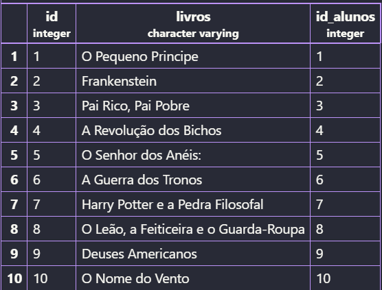
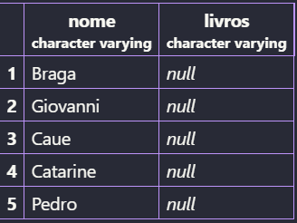

## Relacionamento entre tabelas de uma biblioteca
A ideia centreal, é relacionar duas tabelas distintas, a *ALUNOS* e *EMPRESTIMOS*

---

1- Primeiro criamos a tabela clientes:
```sql
CREATE TABLE aluno(
    id SERIAL PRIMARY KEY,
    nome VARCHAR(50) NOT NULL
)
```

2-Criamos a tabela EMPRESTIMOS com referência à coluna ID da tabela ALUNOS:
```sql
CREATE TABLE emprestimo(
    id SERIAL PRIMARY KEY,
    livros VARCHAR(50) NOT NULL,
    id_alunos INT REFERENCES aluno (id)
)
```
3- com esse código eu adicionei os alunos que emprestaram livros
```sql
INSERT INTO aluno (nome) VALUES ('Bea'),('Gabriel'),('Filipe'),('Julia'),('Catarina'),('Kauan'),('Caio'),('Elis'),('Eloá'),('Gabrielli'),('Braga'),('Giovanni'),('Catarine'),('Pedro'),('Caue');

SELECT * FROM aluno;
```


4- Aqui adicionei os livros lidos por cada aluno:
```sql
INSERT INTO emprestimo (livros,id_alunos) VALUES ('O Pequeno Principe',1),('Frankenstein',2),('Pai Rico, Pai Pobre',3),('A Revolução dos Bichos',4),('O Senhor dos Anéis:',5),('A Guerra dos Tronos',6),('Harry Potter e a Pedra Filosofal',7),('O Leão, a Feiticeira e o Guarda-Roupa ',8),('Deuses Americanos',9),('O Nome do Vento',10);

SELECT * FROM emprestimo;
```


5- Esse código a seguir, demonstra os alunos que leram livros
```sql
SELECT aluno.nome,emprestimo.livros FROM emprestimo INNER JOIN aluno ON emprestimo. id_alunos = aluno.id
```


6- Já nesse código, mostra a aluna que não leu nada também
```sql
SELECT aluno.nome,emprestimo.livros FROM aluno LEFT JOIN emprestimo ON emprestimo. id_alunos = aluno.id
```


7- Esse só vai aparecer os alunos que não emprestaram nenhum livro
```sql
SELECT aluno.nome,emprestimo.livros FROM aluno LEFT JOIN emprestimo ON emprestimo. id_alunos = aluno.id WHERE emprestimo.id_alunos IS NULL
```


8-Deu errdo esse pois gerou um erro de restrição estrangeira, já que usamos a tabela aluno como referência para o (id_alunos) e na tabela nâo tem o id 50, o código uktilizado:
```sql
INSERT INTO emprestimo (livro, id_alunos) VALUES ('Turma da Mônica', 50);
```