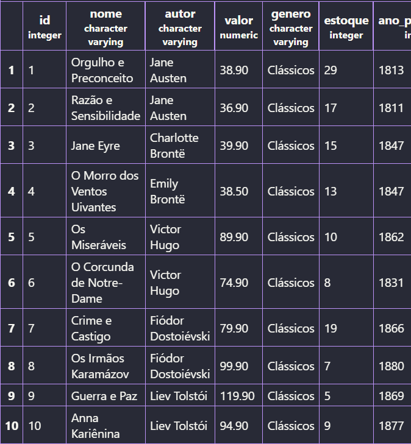
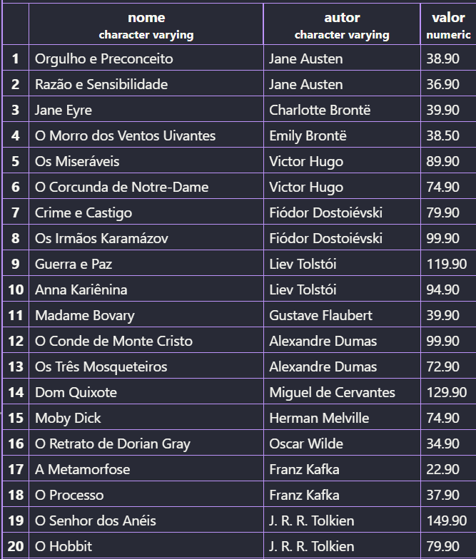
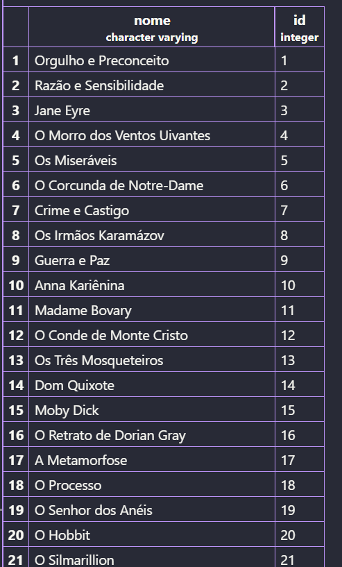
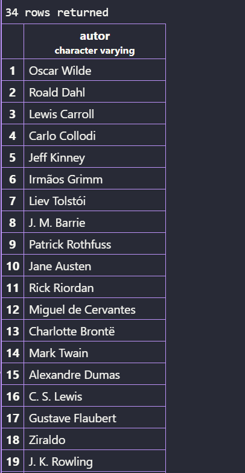
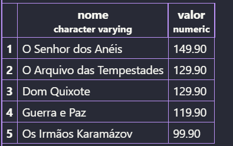
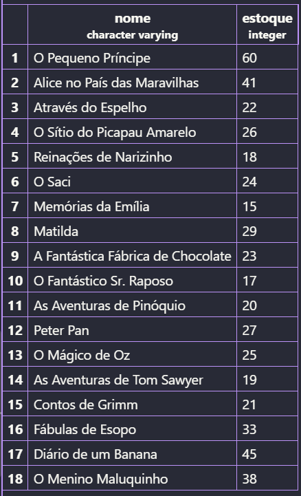
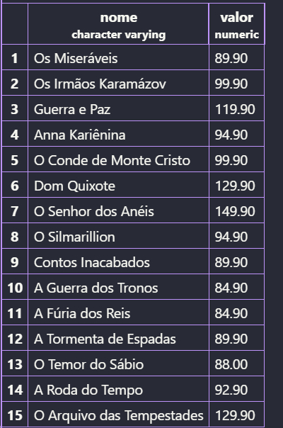
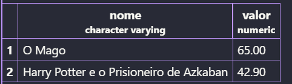
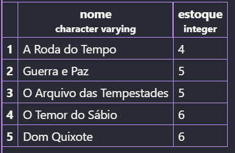
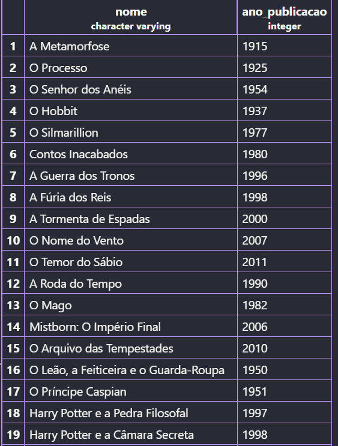

## Rechonhecimento Dos Dados

Criando tabelas:
```sql
CREATE TABLE livrarias(
    id SERIAL PRIMARY KEY,
    nome VARCHAR(60) NOT NULL,
    valor DECIMAL(10,2) NOT NULL,
    autor VARCHAR(30) NOT NULL,
    genero VARCHAR(30) NOT NULL,
    ano_publicacao INT(4) NOT NULL,
    estoque INTEGER NOT NULL
);
```
Para vizuzlizar a tabela:
```sql
SELECT * FROM livrarias;
```
Atribuindo valores a tabela:
```sql
INSERT INTO livrarias (titulo, autor, preco, genero, estoque, ano_publicacao) VALUES
-- Romance Brasileiro
('Dom Casmurro',                              'Machado de Assis',           29.90, 'Romance Brasileiro', 45, 1899),
('Memórias Póstumas de Brás Cubas',           'Machado de Assis',           31.90, 'Romance Brasileiro', 38, 1881),
('Quincas Borba',                             'Machado de Assis',           33.90, 'Romance Brasileiro', 14, 1891),
('Esaú e Jacó',                               'Machado de Assis',           32.50, 'Romance Brasileiro', 12, 1904),
('Helena',                                    'Machado de Assis',           27.90, 'Romance Brasileiro', 16, 1876),
('Iracema',                                   'José de Alencar',            24.90, 'Romance Brasileiro', 50, 1865),
('O Guarani',                                 'José de Alencar',            27.90, 'Romance Brasileiro', 36, 1857),
('Senhora',                                   'José de Alencar',            26.90, 'Romance Brasileiro', 22, 1875),
('Lucíola',                                   'José de Alencar',            25.90, 'Romance Brasileiro', 19, 1862),
('O Cortiço',                                 'Aluísio Azevedo',            28.90, 'Romance Brasileiro', 41, 1890),
('Vidas Secas',                               'Graciliano Ramos',           34.90, 'Romance Brasileiro', 33, 1938),
('São Bernardo',                              'Graciliano Ramos',           36.90, 'Romance Brasileiro', 21, 1934),
('Angústia',                                  'Graciliano Ramos',           38.90, 'Romance Brasileiro', 13, 1936),
('Capitães da Areia',                         'Jorge Amado',                39.90, 'Romance Brasileiro', 27, 1937),
('Gabriela, Cravo e Canela',                  'Jorge Amado',                74.90, 'Romance Brasileiro', 16, 1958),
('Dona Flor e Seus Dois Maridos',             'Jorge Amado',                79.90, 'Romance Brasileiro', 11, 1966),
('Grande Sertão: Veredas',                    'João Guimarães Rosa',        89.90, 'Romance Brasileiro',  9, 1956),
('A Hora da Estrela',                         'Clarice Lispector',          37.90, 'Romance Brasileiro', 24, 1977),
('Laços de Família',                          'Clarice Lispector',          39.90, 'Romance Brasileiro', 18, 1960),
('Macunaíma',                                 'Mário de Andrade',           35.90, 'Romance Brasileiro', 15, 1928),

-- Clássicos
('Orgulho e Preconceito',                     'Jane Austen',                38.90, 'Clássicos',          29, 1813),
('Razão e Sensibilidade',                     'Jane Austen',                36.90, 'Clássicos',          17, 1811),
('Jane Eyre',                                 'Charlotte Brontë',           39.90, 'Clássicos',          15, 1847),
('O Morro dos Ventos Uivantes',               'Emily Brontë',               38.50, 'Clássicos',          13, 1847),
('Os Miseráveis',                             'Victor Hugo',                89.90, 'Clássicos',          10, 1862),
('O Corcunda de Notre-Dame',                  'Victor Hugo',                74.90, 'Clássicos',           8, 1831),
('Crime e Castigo',                           'Fiódor Dostoiévski',         79.90, 'Clássicos',          19, 1866),
('Os Irmãos Karamázov',                       'Fiódor Dostoiévski',         99.90, 'Clássicos',           7, 1880),
('Guerra e Paz',                              'Liev Tolstói',              119.90, 'Clássicos',           5, 1869),
('Anna Kariênina',                            'Liev Tolstói',               94.90, 'Clássicos',           9, 1877),
('Madame Bovary',                             'Gustave Flaubert',           39.90, 'Clássicos',          14, 1857),
('O Conde de Monte Cristo',                   'Alexandre Dumas',            99.90, 'Clássicos',          12, 1844),
('Os Três Mosqueteiros',                      'Alexandre Dumas',            72.90, 'Clássicos',          16, 1844),
('Dom Quixote',                               'Miguel de Cervantes',       129.90, 'Clássicos',           6, 1605),
('Moby Dick',                                 'Herman Melville',            74.90, 'Clássicos',           8, 1851),
('O Retrato de Dorian Gray',                  'Oscar Wilde',                34.90, 'Clássicos',          26, 1890),
('A Metamorfose',                             'Franz Kafka',                22.90, 'Clássicos',          52, 1915),
('O Processo',                                'Franz Kafka',                37.90, 'Clássicos',          20, 1925),

-- Fantasia
('O Senhor dos Anéis',                        'J. R. R. Tolkien',          149.90, 'Fantasia',           22, 1954),
('O Hobbit',                                  'J. R. R. Tolkien',           79.90, 'Fantasia',           35, 1937),
('O Silmarillion',                            'J. R. R. Tolkien',           94.90, 'Fantasia',            8, 1977),
('Contos Inacabados',                         'J. R. R. Tolkien',           89.90, 'Fantasia',            6, 1980),
('A Guerra dos Tronos',                       'George R. R. Martin',        84.90, 'Fantasia',           19, 1996),
('A Fúria dos Reis',                          'George R. R. Martin',        84.90, 'Fantasia',           14, 1998),
('A Tormenta de Espadas',                     'George R. R. Martin',        89.90, 'Fantasia',           10, 2000),
('O Nome do Vento',                           'Patrick Rothfuss',           76.50, 'Fantasia',           16, 2007),
('O Temor do Sábio',                          'Patrick Rothfuss',           88.00, 'Fantasia',            6, 2011),
('A Roda do Tempo',                           'Robert Jordan',              92.90, 'Fantasia',            4, 1990),
('O Mago',                                    'Raymond Feist',              65.00, 'Fantasia',           11, 1982),
('Mistborn: O Império Final',                 'Brandon Sanderson',          74.90, 'Fantasia',           13, 2006),
('O Arquivo das Tempestades',                 'Brandon Sanderson',         129.90, 'Fantasia',            5, 2010),
('O Leão, a Feiticeira e o Guarda-Roupa',     'C. S. Lewis',                39.90, 'Fantasia',           34, 1950),
('O Príncipe Caspian',                        'C. S. Lewis',                39.90, 'Fantasia',           21, 1951),
('Harry Potter e a Pedra Filosofal',          'J. K. Rowling',              39.90, 'Fantasia',           70, 1997),
('Harry Potter e a Câmara Secreta',           'J. K. Rowling',              39.90, 'Fantasia',           58, 1998),
('Harry Potter e o Prisioneiro de Azkaban',   'J. K. Rowling',              42.90, 'Fantasia',           47, 1999),
('Percy Jackson e o Ladrão de Raios',         'Rick Riordan',               38.90, 'Fantasia',           39, 2005),
('A Bússola de Ouro',                         'Philip Pullman',             37.90, 'Fantasia',           18, 1995),

-- Infantil
('O Pequeno Príncipe',                        'Antoine de Saint-Exupéry',   29.90, 'Infantil',           60, 1943),
('Alice no País das Maravilhas',              'Lewis Carroll',              32.90, 'Infantil',           41, 1865),
('Através do Espelho',                        'Lewis Carroll',              31.90, 'Infantil',           22, 1871),
('O Sítio do Picapau Amarelo',                'Monteiro Lobato',            37.90, 'Infantil',           26, 1920),
('Reinações de Narizinho',                    'Monteiro Lobato',            35.90, 'Infantil',           18, 1931),
('O Saci',                                    'Monteiro Lobato',            29.90, 'Infantil',           24, 1921),
('Memórias da Emília',                        'Monteiro Lobato',            33.90, 'Infantil',           15, 1936),
('Matilda',                                   'Roald Dahl',                 34.90, 'Infantil',           29, 1988),
('A Fantástica Fábrica de Chocolate',         'Roald Dahl',                 36.90, 'Infantil',           23, 1964),
('O Fantástico Sr. Raposo',                   'Roald Dahl',                 32.90, 'Infantil',           17, 1970),
('As Aventuras de Pinóquio',                  'Carlo Collodi',              34.90, 'Infantil',           20, 1883),
('Peter Pan',                                 'J. M. Barrie',               33.90, 'Infantil',           27, 1911),
('O Mágico de Oz',                            'L. Frank Baum',              35.90, 'Infantil',           25, 1900),
('As Aventuras de Tom Sawyer',                'Mark Twain',                 37.90, 'Infantil',           19, 1876),
('Contos de Grimm',                           'Irmãos Grimm',               39.90, 'Infantil',           21, 1812),
('Fábulas de Esopo',                          'Esopo',                      29.90, 'Infantil',           33, 1867),
('Diário de um Banana',                       'Jeff Kinney',                39.90, 'Infantil',           45, 2007),
('O Menino Maluquinho',                       'Ziraldo',                    34.90, 'Infantil',           38, 1980);
```
Exibindo todos os dados da tabela, mas limitando o resultado aos 10 primeiros registros:
```sql
SELECT * FROM livrarias LIMIT 10;
```


Exibindo apenas as colunas titulo, autor e preco de todos os livros:
```sql
SELECT nome,autor,valor FROM livrarias;
```


Listando os gêneros distintos existentes na base, em ordem alfabética:
```sql
SELECT DISTINCT genero FROM livrarias ORDER BY genero;
```


Descubrindo quantos livros existem no total, e depois quantos autores diferentes existem:
```sql
SELECT nome,id FROM livrarias;
```

e
```sql
SELECT DISTINCT autor FROM livrarias;
```


Listando os 5 livros mais caros da base (título e preço):
```sql
SELECT nome,valor FROM livrarias ORDER BY valor DESC LIMIT 5;
```


 Listando os 5 livros com menor estoque (título e estoque):
 ```sql
 SELECT nome FROM livrarias ORDER BY estoque  LIMIT 5;
 ```


 ## Filtros Numéricos

 Mostrando titulo e estoque de todos os livros do gênero Infantil:
 ```sql
 SELECT nome,estoque FROM livrarias WHERE genero LIKE 'Infantil%';
 ```


Mostrando titulo e preco dos livros que custam mais de R$ 200,00:
```sql
SELECT nome,valor FROM livrarias WHERE valor >= 80;
```


 Mostrando titulo e preco dos livros com preço entre R$ 40,00 e R$ 70,00:
 ```sql
 SELECT nome,valor FROM livrarias WHERE valor BETWEEN 40 and 70;
 ```
 

 Mostrando os livros com estoque abaixo de 5 unidades (situação de reposição urgente):
 ```sql
 SELECT nome,estoque FROM livrarias ORDER BY estoque LIMIT 5;
 ```
 

 Listando os livros publicados antes de 1900, ordenados do mais antigo para o mais recente:
 ```sql
  SELECT nome,ano_publicacao FROM livrarias WHERE ano_publicacao > 1900;
  ```


 Listando os livros publicados entre 2010 e 2020, mostrando título, ano e gênero:
```sql
 SELECT nome,genero,ano_publicacao FROM livrarias WHERE ano_publicacao BETWEEN 2010 AND 2020;
```
