## Atividade de Analise de Dados

Iniciei crindo a tabela e inserindo os dados (não vou por o código em si pois são 1000 itens), dividimos naas seguintes seleções:
```sql
CREATE TABLE produtos(
    id SERIAL PRIMARY KEY,
    nome VARCHAR (100) NOT NULL,
    categoria VARCHAR (50) NOT NULL,
    marca VARCHAR (50) NOT NULL,
    preco NUMERIC (10,2) NOT NULL,
    estoque INT NOT NULL,
    data_cadastro DATE NOT NULL
);
```
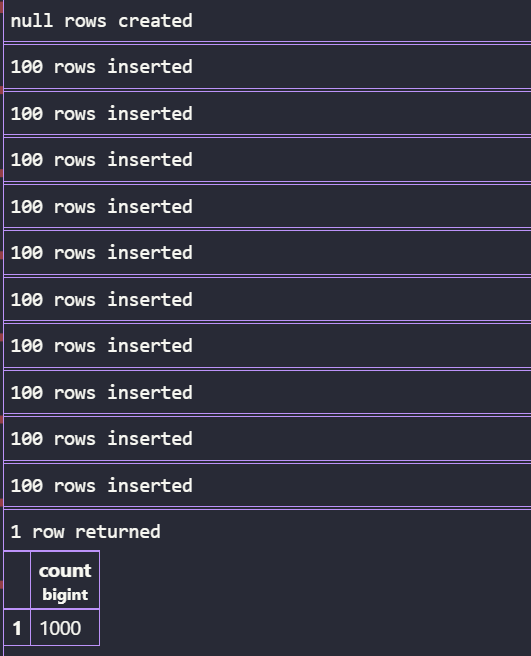

### Consulta de Dados e Filtros
#### Parte A
*Agora comecei as consultas com o nome e o preço de todos os produtos da categoria Monitores.*

```sql
SELECT nome,categoria,preco 
FROM produtos
WHERE categoria = 'Monitores';
```

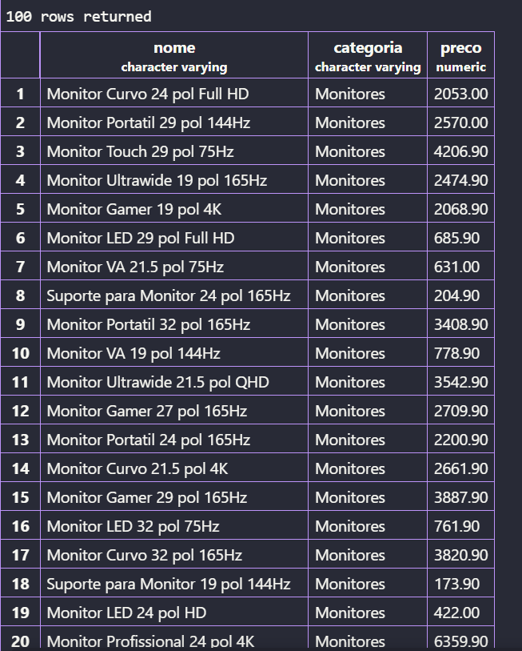

*Tambem mostando os produtos com estoque menor que 5 unidades, mostrando nome, categoria e estoque.*

```sql
SELECT nome,categoria,estoque AS qtd_produtos_baixo
FROM produtos
WHERE estoque < 5;
```

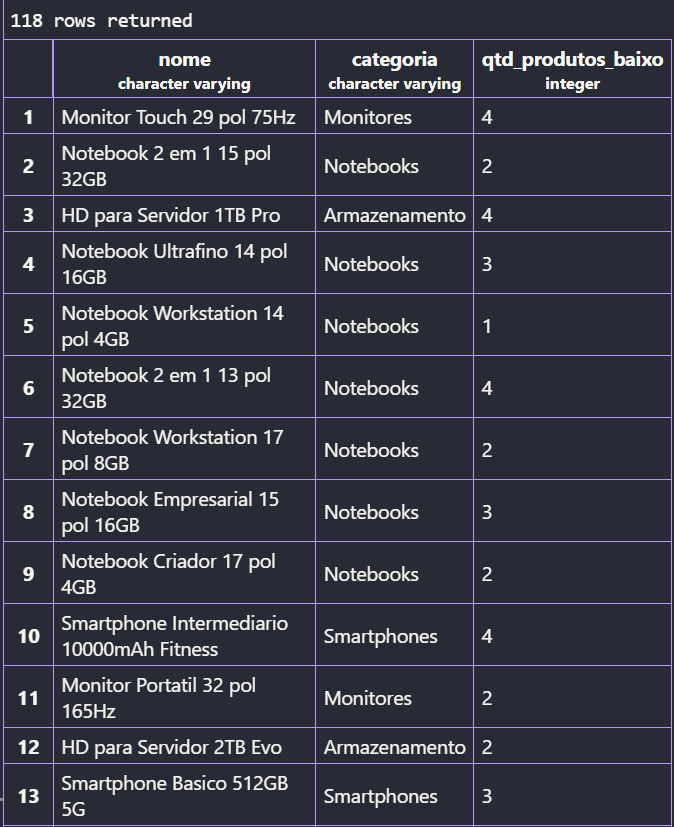

*E os 10 produtos mais caros da loja (nome e preço), do mais caro para o mais barato.*

```sql
SELECT nome,preco 
FROM produtos 
ORDER BY preco DESC
LIMIT 100;
```

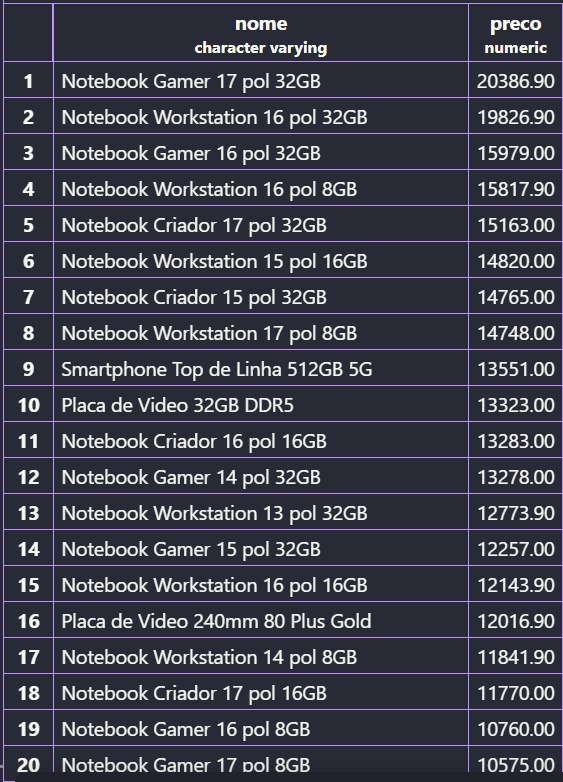

*A separação dos produtos da Logitech, ordenados por preço crescente.*

```sql
SELECT nome,marca,preco 
FROM produtos
WHERE marca = 'Logitech'
ORDER BY preco
LIMIT 100;
```

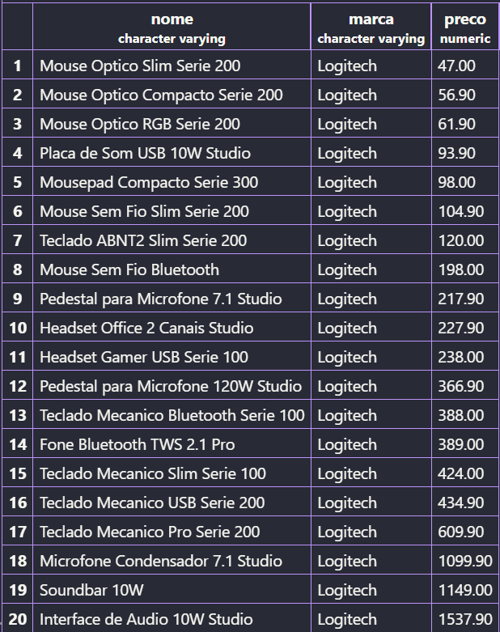

*Liste os produtos com preço entre R$ 100,00 e R$ 500,00, mostrando nome e preço*

```sql
SELECT nome, preco
FROM produtos
WHERE preco
BETWEEN 100 AND 500
```

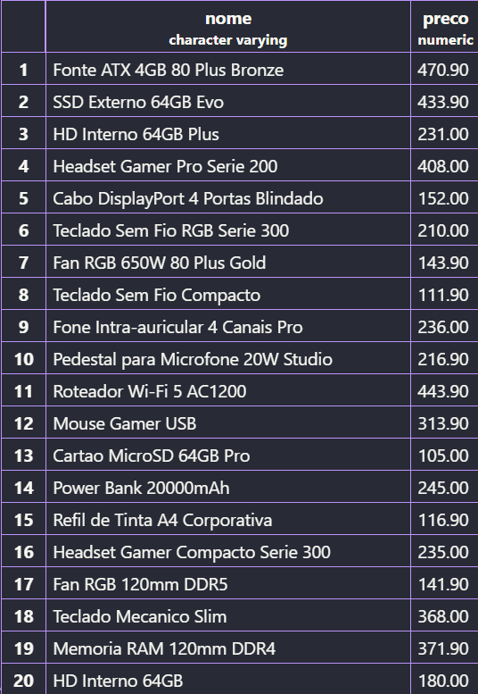

### Funções de Agregação
#### Parte B
*A quantidade de produtos existem cadastrados na loja*

```sql
SELECT COUNT(*) AS total_produtos 
FROM produtos;
```


*A quantidade de  produtos estão com estoque abaixo de 10 unidades*

```sql
SELECT COUNT(*) AS produtos_em_falta
FROM produtos
WHERE estoque <= 10;
```

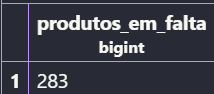

*Os maiores e o menores preços da loja* 

```sql
SELECT 
COUNT(*) AS produtos,
MAX(preco) AS maior_preço,
MIN(preco) AS menor_preço
FROM produtos;
```

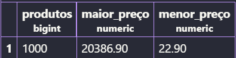

*O preço médio dos produtos da categoria Notebooks*

```sql
SELECT ROUND(AVG(preco),2) AS media_notebooks 
FROM produtos
WHERE categoria = 'Notebooks';
```

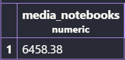

*A quantidade de peças a loja tem no total, somando o estoque de todos os produtos*

```sql
SELECT SUM(estoque) AS total_de_pecas
FROM produtos;
```


### PAINEL E CÁLCULOS
#### Parte C

*Monte um painel resumo em uma única consulta, retornando de uma vez: quantidade de produtos, preço médio (2 casas decimais), maior preço, menor preço e total de peças em estoque. Todas as colunas devem ter nomes compreensíveis para o gerente*

```sql
SELECT 
COUNT(*) AS produtos,
MAX(preco) AS maior_preço,
MIN(preco) AS menor_preço,
ROUND(AVG(preco),2) AS media
SUM(estoque) AS total_peças
FROM produtos;
```

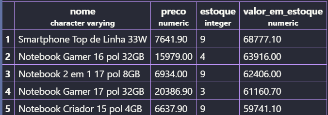

*FOI Criado uma coluna calculada valor_em_estoque e mostrando os 5 produtos com maior valor imobilizado, exibindo nome, preço, estoque e o valor calculado.*

```sql
SELECT nome,preco,estoque,(preco*estoque) AS valor_em_estoque
FROM produtos
ORDER BY valor_estoque DESC
limit 5;
```

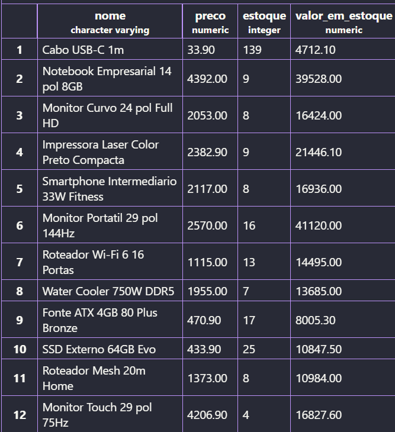

*Compare o resultado de C2 com o produto mais caro que apareceu em A3. É o mesmo item? Escreva duas linhas explicando o que essa comparação revela sobre o estoque da loja.*

A comparação mostra que não é o mesmo produto, já que no A3 esta mostando o valor de uma única unidade do produto (apenas um Notebook) e no C2 mostra a soma dos valores de todos os produtos em estoque( 9 smartphones).