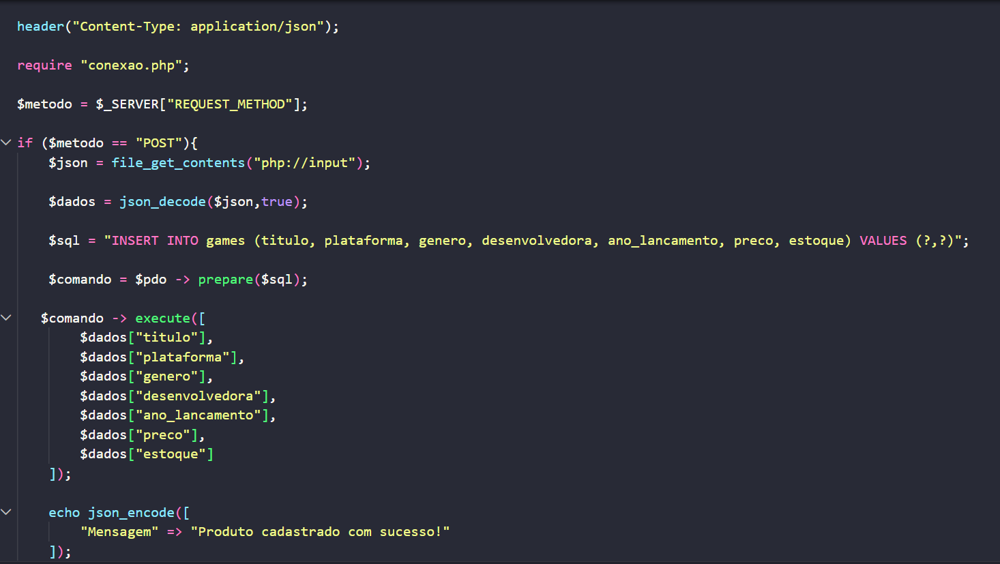
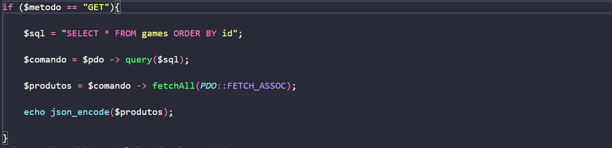
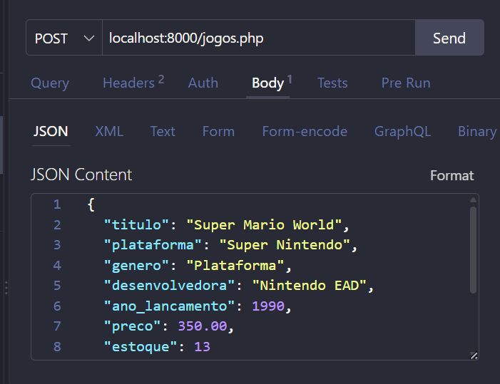
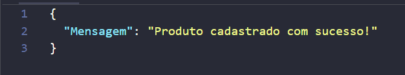
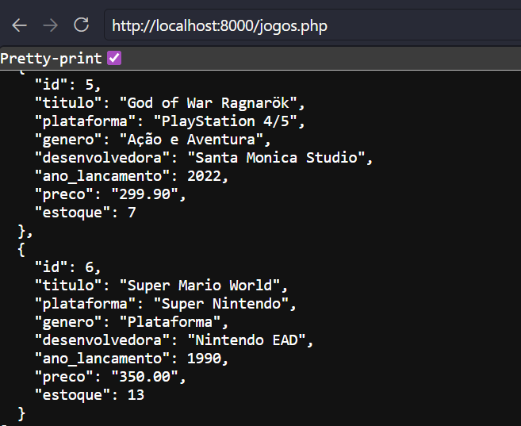
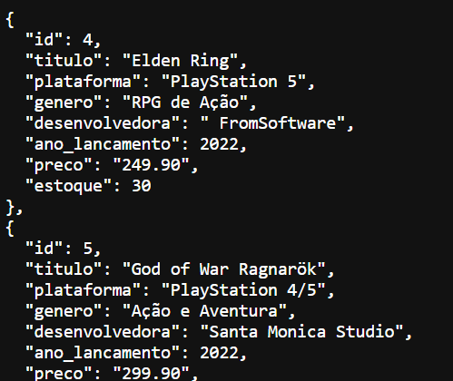

## Level Up - Aula 07

*Iniciei criando o Banco de dados, Level Up, no Moba*

*Logo criei a tabela no VSCODE:*

```
CREATE TABLE jogos (
    id SERIAL PRIMARY KEY,
    titulo VARCHAR (50) NOT NULL,
    plataforma VARCHAR (30) NOT NULL,
    genero VARCHAR (30) NOT NULL,
    desenvolvedora VARCHAR (60) NOT NULL,
    ano_lancamento INT,
    preco NUMERIC (10,2),
    estoque INT
);
```
*Então eu o criei no método POST e GET:*




*E logo fui adicionando as informações no método POST:*




*E para analisar se os dados foram cadastrados ultilizei o método GET:*



*E para organiza-los eu os coloquei em orde alfabetica*



*Trabalho realizado por: Catarina Costa*

